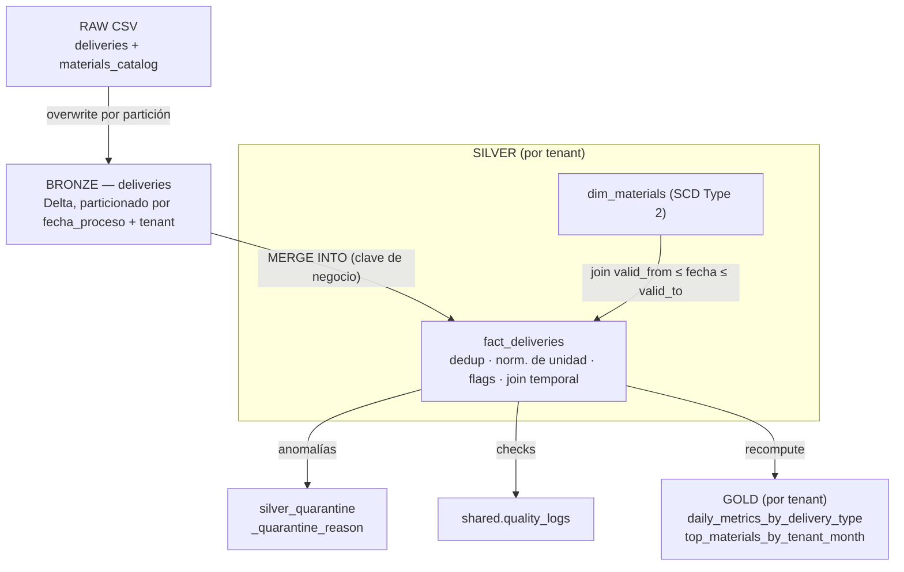

# SAAS Data Platform — Pipeline Medallion multi-tenant

Implementación de la arquitectura de referencia del proyecto SAAS: un pipeline
Bronze → Silver → Gold multi-tenant sobre **PySpark + Delta Lake**, con
configuración jerárquica, enriquecimiento SCD Type 2, control de calidad y
cuarentena de anomalías. El aislamiento por tenant se expresa en el layout de
almacenamiento, que refleja el layout de schemas por tenant de Unity Catalog.

El mismo código corre en dos modos intercambiables (ver
[storage.py](src/saas_pipeline/storage.py)):

- **Local (por defecto):** Delta en paths bajo `data/<env>/...`. Reproducible, sin cuenta.
- **Unity Catalog:** con `--catalog <nombre>` escribe tablas `<catalog>.<layer>_<tenant>.<table>`.
  Ver [docs/databricks.md](docs/databricks.md).

## Arquitectura



Aislamiento multi-tenant: `data/<layer>/<tenant>/<table>` (local) equivale a
`<catalog>.<layer>_<tenant>.<table>` (Unity Catalog).

## Stack y versiones exactas

| Componente | Versión |
|-----------|---------|
| Python | 3.12 (fijado `>=3.12,<3.13`) |
| PySpark | 3.5.3 |
| Delta Lake (`delta-spark`) | 3.2.1 |
| OmegaConf | 2.3.0 |
| Java (runtime de Spark local) | OpenJDK 17 |
| Gestor de entorno y dependencias | `uv` |

Uso Python 3.12 para alinear con el runtime serverless de Databricks del modo
Unity Catalog. El enunciado pide "Python 3.11 o superior" y PySpark 3.5.x, ambos
cumplidos. El mismo código corre local y en Databricks.

## Estructura del repositorio

```
saas-data-platform/
├── config/                 # OmegaConf: base + env/<env> + tenants/<tenant>
├── src/saas_pipeline/
│   ├── config.py           # carga jerárquica de configuración
│   ├── spark_session.py    # sesión Spark con Delta (local + Databricks)
│   ├── paths.py            # Location de tabla: path local o identificador UC
│   ├── storage.py          # lectura/escritura/upsert Delta en ambos modos
│   ├── schemas.py          # esquemas explícitos de origen y quality_logs
│   ├── transforms.py       # transformaciones puras, testeables
│   ├── bronze.py           # ingesta CSV -> Delta
│   ├── silver.py           # dim SCD2, MERGE de hechos, cuarentena, enriquecimiento
│   ├── gold.py             # daily_metrics_by_delivery_type + top_materials
│   ├── quality.py          # checks de calidad + persistencia en quality_logs
│   ├── pipeline.py         # orquestación por tenant / multi-tenant
│   └── cli.py              # entrypoint de línea de comandos
├── tests/                  # suite pytest (transforms, quality, gold, config)
├── mentoring/              # ejercicio de code review
├── databricks/             # notebook + setup SQL para correr en Unity Catalog
├── docs/                   # observations, infra, databricks, onboarding
├── data/raw/               # CSVs de entrada (versionados)
├── .github/workflows/ci.yml
├── Makefile
└── pyproject.toml
```

Sobre el layout: el paquete agrega algunos módulos de apoyo (`spark_session`,
`paths`, `storage`, `transforms`, `pipeline`) más allá del esqueleto sugerido.
`transforms.py` aísla la lógica de negocio pura para poder testearla sin un
warehouse, y los módulos de capa quedan enfocados en I/O.

## Puesta en marcha

Requiere `uv` y un JDK 17 en el `PATH`.

```bash
# Java 17 (macOS / Homebrew)
brew install openjdk@17
export JAVA_HOME="$(brew --prefix openjdk@17)"
export PATH="$JAVA_HOME/bin:$PATH"

make setup        # instala Python 3.12 + proyecto + dependencias dev en .venv
```

## Ejecución

```bash
# Pipeline completo, dev, todos los tenants
make run

# O directamente, con parámetros:
uv run saas-pipeline --env dev --tenant sv --start-date 2025-03-01 --end-date 2025-03-31
uv run saas-pipeline --env dev --tenant all --layer silver
uv run saas-pipeline --env main --tenant all        # activa fail_fast + fail_on_critical
```

Flags: `--env {dev,qa,main}`, `--tenant <código>|all`, `--start-date`, `--end-date`,
`--layer {bronze,silver,gold,all}`, `--catalog <nombre>`, `--fail-fast`, `--fail-on-critical`.

Para escribir tablas Unity Catalog en lugar de paths locales (Databricks), pasá
`--catalog saas_dev`. Instrucciones completas en [docs/databricks.md](docs/databricks.md).

Las salidas se escriben bajo `data/<env>/` siguiendo el layout de la arquitectura:

```
data/<env>/bronze/<tenant>/deliveries/fecha_proceso=YYYYMMDD/_tenant_id=<t>/
data/<env>/silver/<tenant>/fact_deliveries/fecha_proceso=YYYYMMDD/
data/<env>/silver/<tenant>/dim_materials/
data/<env>/silver_quarantine/<tenant>/fact_deliveries/
data/<env>/gold/<tenant>/daily_metrics_by_delivery_type/fecha_proceso=YYYYMMDD/
data/<env>/gold/<tenant>/top_materials_by_tenant_month/
data/<env>/shared/quality_logs/
```

## Tests y linter

```bash
make lint     # ruff (PEP8)
make test     # pytest
make hooks    # instala los hooks de pre-commit (ruff + higiene)
```

## Onboarding de un tenant nuevo

El pipeline es data-driven: dar de alta un tenant es configuración, no código.
Ver [docs/onboarding-tenant.md](docs/onboarding-tenant.md). En resumen:

1. Agregar el código del tenant a `tenants:` en `config/base.yaml`.
2. Crear `config/tenants/<tenant>.yaml` con su perfil (y overrides si hace falta).
3. Asegurar que el origen entregue filas para ese `pais`. Correr `--tenant <código>`.

No cambia código de transformación. En Databricks esto se traduce en crear los
schemas Bronze/Silver/Gold del tenant en Unity Catalog (módulo Terraform en
[docs/infra.md](docs/infra.md)).

## Qué dejé fuera y por qué

- **ADLS Gen2 no provisionado.** El modo local simula el almacenamiento por capas
  con paths, como indica la prueba. La salida a Unity Catalog está implementada
  como modo opcional (`--catalog`), validada en Databricks Free Edition; el
  snippet de Terraform ([docs/infra.md](docs/infra.md)) muestra el
  aprovisionamiento en la nube, que no se ejecuta acá.
- **Sin Auto Loader / streaming.** Bronze es batch CSV a Delta. El streaming es un
  bonus; el diseño batch mantiene la idempotencia demostrable dentro del tiempo
  disponible. La ruta de migración está en [docs/observations.md](docs/observations.md).
- **`terraform plan` real no ejecutado.** Solo se entrega el módulo ilustrativo,
  según la sección 7.2.
- **Sin dashboard.** Bonus (§10), fuera de alcance.

Bonus que sí incluí: una segunda tabla Gold (`top_materials_by_tenant_month`), el
modo Unity Catalog (`--catalog`) y los hooks de pre-commit.

Ver [docs/observations.md](docs/observations.md) para las observaciones a la
arquitectura y [mentoring/](mentoring/) para el ejercicio de code review.
